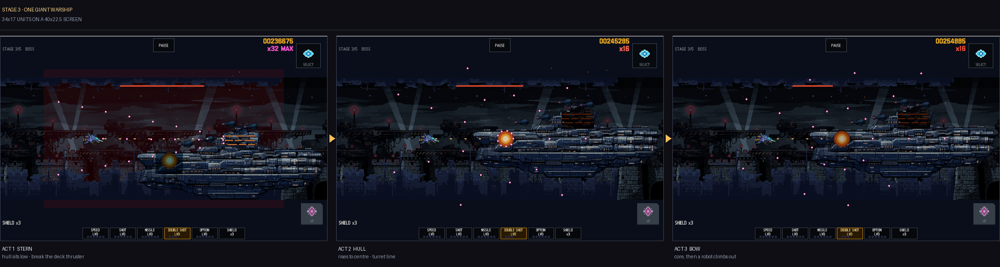
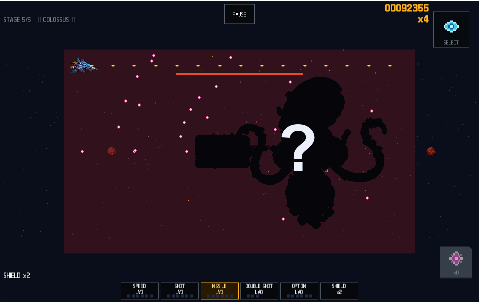

# ROGUELIKE SCROLLING SHOOTER

그라디우스 계열의 2D 횡스크롤 슈팅에 로그라이크 런 구조를 얹은 SNES풍 픽셀 아트 게임.

**▶ 바로 플레이: https://pavy23.github.io/rss-play** (iPhone·모바일 브라우저 터치 지원, 데스크톱 키보드/게임패드 지원)


## 게임은 이렇게 흘러간다

한 번의 런은 5개의 바이옴(스테이지)을 관통한다 — 고철 폐선장 → 생체 군체 → 요새 → 성운 폭풍 → 적의 코어. 각 스테이지는 **전반 → 중간보스 → 후반 → 스테이지 보스**로 흐르고, 보스를 잡으면 **다음 섹터로 가는 항로**를 고른다: 어느 바이옴으로 갈지, 그리고 어떤 조건(적 밀도 +40% 대신 캡슐 +50% 같은 리스크 계약)으로 갈지가 한 장의 카드다. 죽으면 끝 — 점수는 크레딧이 되어 새 기체를 해금한다.

같은 시드는 언제나 같은 런을 만든다. 날마다 전 세계 공통 시드로 겨루는 **데일리 런**, 마지막 런을 그대로 다시 보는 **리플레이**, 중단한 곳에서 잇는 **이어하기**가 전부 여기서 나온다.

각 스테이지는 구간마다 배경과 위협이 변한다 — 전반의 오픈 물량전이 중간보스 격파와 함께 황혼으로 물들고, 후반엔 지형이 좁혀들며 랜드마크가 다가온다.


## 조작

| 플랫폼 | 조작 |
|---|---|
| 터치 (권장) | 화면 드래그 = 기체가 손가락을 따라옴 · 발사는 상시 자동 · **SELECT** = 게이지 발동 · **BOMB** = 전멸 폭탄 |
| 키보드 | 방향키/WASD 이동 · 스페이스 게이지 발동 · B 폭탄 · T 난이도 · D 데일리 런 · C 이어하기 · V 리플레이 · 숫자키 시드 입력 |
| 게임패드 | 스틱 이동 · (A) 발동 · (B) 폭탄 · RB 데일리 · LB 리플레이 · (X) 이어하기 |

화면은 색으로 말한다: **내 탄은 주황, 적 탄은 마젠타**다. 탄막이 두꺼워져도 어느 쪽이 나를 죽이는 탄인지 색 하나로 갈린다. 청록은 "지금은 못 깎는다"는 뜻이라, 청록으로 맥동하는 파츠를 쏘면 탄이 청록 스파크로 튕긴다.

## 파워업 — 그라디우스 방식 게이지

적이 떨어뜨리는 **캡슐**을 먹으면 게이지 커서가 한 칸씩 전진한다. 원하는 칸에서 발동(SELECT)하면 소비 — **어디에 쓰는가가 곧 빌드다.** 캡슐 하나 = 레벨 하나.

| 칸 | 효과 |
|---|---|
| SPEED | 이동속도 상승 (레벨당 +1.5) |
| SHOT | 주무기 강화 (최대 6레벨) — 데미지 +50%/레벨, 연사도 빨라짐 |
| MISSILE | 미사일 발사 + 레벨당 위력 상승 |
| **기체 무기** | 기체 고유 무기, **재발동마다 3단 진화** (아래) |
| OPTION | 분신 최대 6기 — 주무기·미사일을 함께 쏜다 |
| SHIELD | 실드 **재고 +1** — 레벨이 아니라 장수다. 실드가 유일한 목숨이고, 0에서 맞으면 즉사 |

## 기체 3종 — 셋 다 다르게 큰다

| 기체 | 성향 | 고유 무기 진화 (1→2→3단) | 미사일 | 옵션 편성 |
|---|---|---|---|---|
| **Starter** | 밸런스 (실드 1) | 더블 → **테일 가드**(후방탄) → **크로스 파이어**(전후상하 십자) | 하강 폭격 | 궤적 추종 |
| **Interceptor** | 빠르고 취약 (실드 0) | 트리플 → **펄스 팬**(5-way 맥동) → **버너**(관성탄+고연사) | 직선 | 고정 포메이션 |
| **Bulwark** | 느린 탱커 (실드 2) | 레이저 → **랜스**(관통 4+폭발) → **프리즘 빔**(지속 광선) | 유도 | 궤도 회전 |

Interceptor는 25,000 크레딧, Bulwark는 50,000 크레딧으로 격납고에서 해금.

## 보스전 — 뒤로 갈수록 판이 커진다



- 보스는 페이즈마다 이동과 탄막이 바뀌고, 탄막 어휘(대구경·파편·기뢰·레이저)에 스테이지별 시그니처가 얹힌다 — 고철 투척, 유충 산란, 레이저 그리드, 낙뢰, 회전 프리즘 빔.
- **스테이지가 오를수록 구조가 한 축씩 늘어난다**: 2스테이지 보스는 화면을 쓸어내는 촉수 파츠를 달고 나오고, 4스테이지 보스는 **번개룡**(세그먼트 체인 — 머리만 노려라)을 소환한다.
- **3스테이지는 보스전 전체가 거대 전함 1척이다** — 화면 절반을 가로지르는 함체를 따라 함미 추진기를 부수고(중간보스), 갑판의 포탑 라인을 헤치며 전진해, 함수 코어와 결전한다. **포탑을 많이 부술수록 코어전 개막 탄막이 얇아진다.**
- **최종 스테이지 후반엔 과거의 내가 돌아온다** — 이번 런의 1스테이지 플레이 기록이 고스트 기체로 재생돼 함께 싸운다. 최종 보스는 격파해도 끝이 아니다 — 두 번째 형태가 기다린다.
- **미지의 구역**의 거대 보스 2종은 화면 절반을 채우는 3막 전투다: 외갑 방벽을 뚫으면 갑각이 열리며 **화면을 관통하는 참수 레일건**이(레비아탄), 아가리가 벌어지며 **기체를 빨아들이는 흡입 역장**이(브루드마더) 기다린다.



- **지금 못 깎는 곳은 화면이 말해 준다** — 아직 열리지 않은 파츠는 어둡게 가라앉고 청록으로 맥동한다. 그런 곳에 쏘면 탄이 **청록 스파크로 튕긴다**. 데미지가 들어갈 때의 흰 폭발과 색이 갈리므로, 헛치고 있는지 한 프레임에 알 수 있다.

## 점수는 위험을 보상한다

- 적탄을 **아슬아슬하게 스치면(그레이즈)** 점수와 콤보 게이지를 얻는다 — 스치기 10번이면 첫 배율. 배율은 **최대 ×32**까지 오른다.
- 격파와 그레이즈 **둘 다** 콤보를 잇는다. 5초간 아무것도 없으면 배율이 한 단계 식으므로, 잡졸이 얇은 보스전에서는 탄막에 붙어 스치며 버티는 것이 배율을 지키는 방법이다.
- 히든 조건 3가지 — **엘리트 룸 3회 클리어 · 무피해 바이옴 2회 · 희귀 조우 1회** — 중 **2개**를 채우면 극한 항로 **미지의 구역**(점수 ×1.25)이 열린다. 거대 멀티파트 보스를 잡으면 PerfectClear.

## 글로벌 스코어보드

게임오버 화면에서 **SUBMIT SCORE**로 세계 랭킹에 이름을 올린다. 보드는 두 개 — 매일 전 세계 공통 시드로 겨루는 **데일리**, 자유 런의 **전체**.

| 컬럼 | 의미 |
|---|---|
| `#` / `PILOT` / `SCORE` | 순위 · 이름(2~10자) · 점수 |
| `STG` | 도달 지점 (`3-2` = 3스테이지 2룸, `CLR` = 클리어, `PFT` = PerfectClear) |
| `SHIP` | 기체 (`ST`/`IC`/`BW`) |
| `BOMB` | 폭탄 사용 횟수 — **0이면 노봄 런**으로 강조 |

제출은 정정당당한 런만: 치트 사용 런, **시드를 직접 입력한 런**, 리플레이는 제출이 막힌다(리롤 버튼의 랜덤 시드는 무관). 같은 기기에서는 최고 기록 하나만 남는다.

## 자기 제약 계약 — 저강화가 곧 점수다

항로 카드에는 스스로를 묶는 대신 점수 배율을 받는 **SPARTAN 계약**이 섞여 나온다:

| 계약 | 제약 | 배율 |
|---|---|---|
| **SPARTAN PROTOCOL** | 게이지 발동 전면 금지 (캡슐 적립은 됨) | ×1.6 |
| **BARE HULL** | 실드 발동 금지 | ×1.4 |
| **NO OPTION RUN** | 옵션 발동 금지 | ×1.3 |

계약 중 금지된 칸을 발동하려 하면 게이지 위에 **CONTRACT LOCK** 표시가 뜬다.

## 보상과 대가

중간보스·보스를 잡을 때마다 보상 카드를 고른다(캡슐 5개로 리롤 가능). 일부 보상엔 **붉은 글씨의 대가**가 붙어 있다 — 데미지 +2 대신 실드 상한 -1 같은. 미사일 계열 교체, 옵션 편성 교체, 관통탄·도탄·격파 폭발 같은 탄 개조도 여기서 나온다.

## 크레딧과 컨티뉴 — 판돈을 걸어라

죽으면 점수가 크레딧이 된다. 크레딧은 격납고에서 **기체 해금**(Interceptor 50,000 / Bulwark 100,000)과 **컨티뉴 구매**(최대 8개 적립, 살수록 비싸진다)에 쓴다.

- 컨티뉴를 쓰면 그 자리에서 다시 날지만 **런 점수는 0으로 리셋**된다 — 랭킹은 정직하게.
- **최종 보스전에 들어서는 순간, 남은 컨티뉴 전량이 회수되어 실드로 환산된다.** 아껴온 컨티뉴가 최후의 판돈이 된다.
- 데일리 런에서는 컨티뉴를 쓸 수 없다 — 전 세계가 같은 조건으로 겨룬다.

---

## 개발

| 문서 | 내용 |
|---|---|
| [AGENTS.md](AGENTS.md) | 에이전트 소유 영역·결정론 규칙·호출 규약(§9)·병합 절차(§3) |
| [ART-DIRECTION.md](ART-DIRECTION.md) | hi-bit 도트 규격(640×360 / PPU 16)과 생성 파이프라인 |
| [ROADMAP.md](ROADMAP.md) | 마일스톤 |
| [Tools/QaHarness/](Tools/QaHarness/README.md) | WebGL 빌드 headless 검증 하네스 (픽셀 어서션) |

빌드·테스트는 **Unity CLI**로 한다 (`Unity.exe -batchmode` 직접 호출 금지):

```
unity test  --mode EditMode --output test-results.xml --non-interactive --no-banner
unity build --target WebGL --execute-method Shmup.EditorTools.MobileBuilder.BuildWebGl --log-file build.log
unity run . -- -executeMethod Shmup.EditorTools.BattleSceneBuilder.Build -logFile scene.log
```

검증 런은 dev 인자로 원하는 지점에 바로 들어갈 수 있다 — `?dev=1&god=1&stage=3&warp=boss`
(구간 워프), `?dev=1&uncharted=1&warp=boss`(미지의 구역 거대 보스). dev 인자가 붙은 런은
점수 제출이 자동으로 막힌다.
