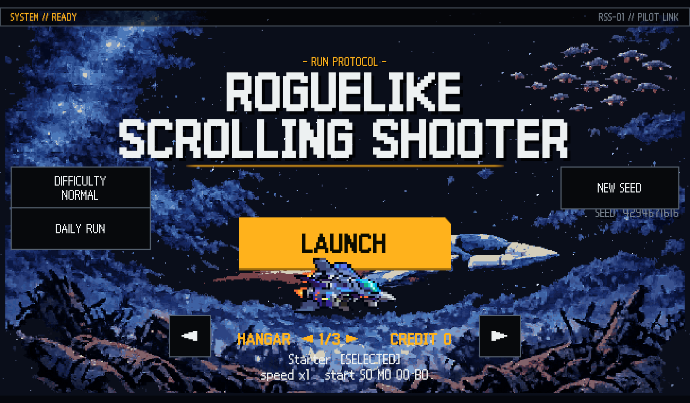
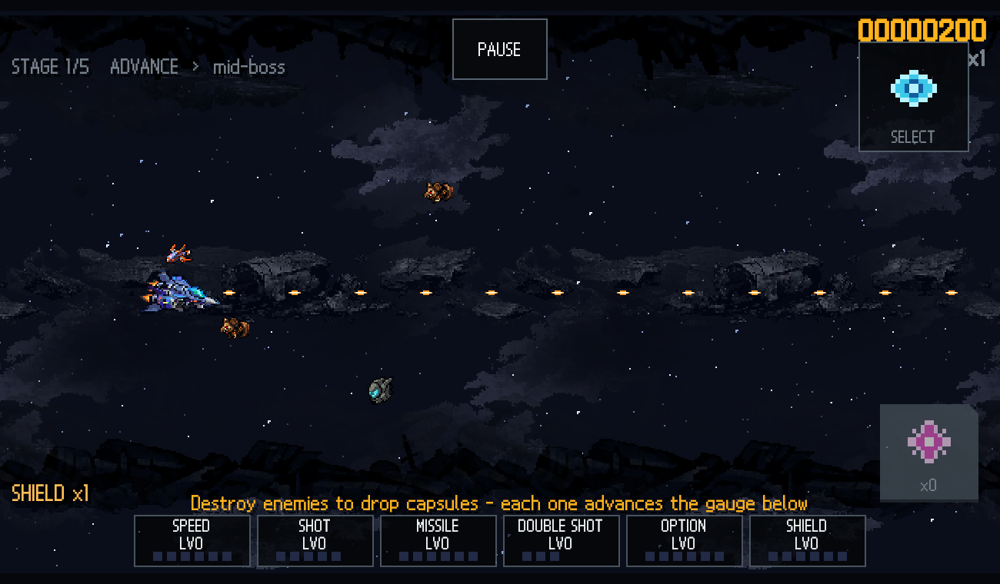
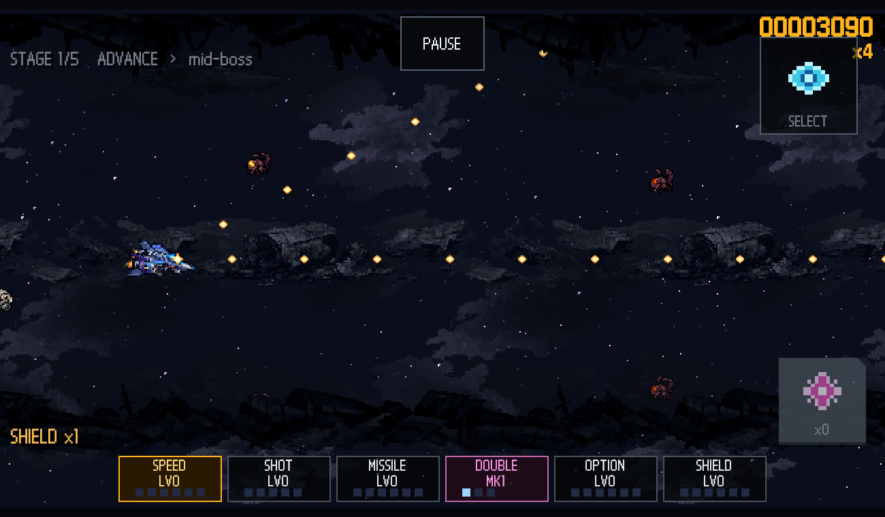

# ROGUELIKE SCROLLING SHOOTER

그라디우스 계열의 2D 횡스크롤 슈팅에 로그라이크 런 구조를 얹은 SNES풍 픽셀 아트 게임.

**▶ 바로 플레이: https://pavy23.github.io/rss-play** (iPhone·모바일 브라우저 터치 지원, 데스크톱 키보드/게임패드 지원)

## 게임은 이렇게 흘러간다

한 번의 런은 5개의 바이옴(스테이지)을 관통한다 — 고철 폐선장 → 생체 군체 → 요새 → 성운 폭풍 → 적의 코어. 각 스테이지는 **전반 → 중간보스 → 후반 → 스테이지 보스**로 흐르고, 보스를 잡으면 **다음 섹터로 가는 항로**를 고른다: 어느 바이옴으로 갈지, 그리고 어떤 조건(적 밀도 +40% 대신 캡슐 +50% 같은 리스크 계약)으로 갈지가 한 장의 카드다. 죽으면 끝 — 점수는 크레딧이 되어 새 기체를 해금한다.

같은 시드는 언제나 같은 런을 만든다. 날마다 전 세계 공통 시드로 겨루는 **데일리 런**, 마지막 런을 그대로 다시 보는 **리플레이**, 중단한 곳에서 잇는 **이어하기**가 전부 여기서 나온다.

## 조작

| 플랫폼 | 조작 |
|---|---|
| 터치 (권장) | 화면 드래그 = 기체가 손가락을 따라옴 · 발사는 상시 자동 · **SELECT** = 게이지 발동 · **BOMB** = 전멸 폭탄 |
| 키보드 | 방향키/WASD 이동 · 스페이스 게이지 발동 · B 폭탄 · T 난이도 · D 데일리 런 · C 이어하기 · V 리플레이 · 숫자키 시드 입력 |
| 게임패드 | 스틱 이동 · (A) 발동 · (B) 폭탄 · RB 데일리 · LB 리플레이 · (X) 이어하기 |

## 파워업 — 그라디우스 방식 게이지

적이 떨어뜨리는 **캡슐**을 먹으면 게이지 커서가 한 칸씩 전진한다. 원하는 칸에서 발동(SELECT)하면 소비 — **어디에 쓰는가가 곧 빌드다.** 캡슐 하나 = 레벨 하나.

| 칸 | 효과 |
|---|---|
| SPEED | 이동속도 상승 (레벨당 +1.5) |
| SHOT | 주무기 강화 — 데미지 +50%/레벨, 연사도 빨라짐 |
| MISSILE | 미사일 발사 + 레벨당 위력 상승 |
| **기체 무기** | 기체 고유 무기, **재발동마다 3단 진화** (아래) |
| OPTION | 분신 최대 6기 — 주무기·미사일을 함께 쏜다 |
| SHIELD | 실드 충전 — 실드가 유일한 목숨이다. 0에서 맞으면 즉사 |

## 기체 3종 — 셋 다 다르게 큰다

| 기체 | 성향 | 고유 무기 진화 (1→2→3단) | 미사일 | 옵션 편성 |
|---|---|---|---|---|
| **Starter** | 밸런스 (실드 1) | 더블 → **테일 가드**(후방탄) → **크로스 파이어**(전후상하 십자) | 하강 폭격 | 궤적 추종 |
| **Interceptor** | 빠르고 취약 (실드 0) | 트리플 → **펄스 팬**(5-way 맥동) → **버너**(관성탄+고연사) | 직선 | 고정 포메이션 |
| **Bulwark** | 느린 탱커 (실드 2) | 레이저 → **랜스**(관통 4+폭발) → **프리즘 빔**(지속 광선) | 유도 | 궤도 회전 |

Interceptor는 25,000 크레딧, Bulwark는 50,000 크레딧으로 격납고에서 해금.

## 보스전

- 보스는 흐름 속에서 화면 끝에서 활강해 들어온다. HP 3분할 페이즈마다 이동과 탄막이 바뀐다.
- 탄막 어휘: 콩알탄 외에 **대구경탄**(주황·느림), **파편탄**(핑크·3갈래 분열), **기뢰탄**(청백·정지 후 조준 돌진), **레이저**(적색 예고선 → 빔).
- 보스마다 고유 시그니처가 있다 — 고철 투척(폐선장), 유충 산란(군체), 레이저 그리드(요새), 낙뢰(성운), 회전 프리즘 빔(코어).

## 점수는 위험을 보상한다

- 적탄을 **아슬아슬하게 스치면(그레이즈)** 점수와 콤보 게이지를 얻는다 — 스치기 10번이면 첫 배율.
- 격파가 콤보를 잇고, 5초간 조용하면 배율이 식는다.
- 히든 조건(엘리트 사냥·무피해 바이옴 등)을 채우면 극한 항로 **미지의 구역**이 열린다 — 거대 멀티파트 보스를 잡으면 PerfectClear.

## 보상과 대가

중간보스·보스를 잡을 때마다 보상 카드를 고른다(캡슐 5개로 리롤 가능). 일부 보상엔 **붉은 글씨의 대가**가 붙어 있다 — 데미지 +2 대신 실드 상한 -1 같은. 미사일 계열 교체, 옵션 편성 교체, 관통탄·도탄·격파 폭발 같은 탄 개조도 여기서 나온다.

---

개발 문서(에이전트 워크플로·아트 방향)는 [AGENTS.md](AGENTS.md), [ART-DIRECTION.md](ART-DIRECTION.md) 참고.
