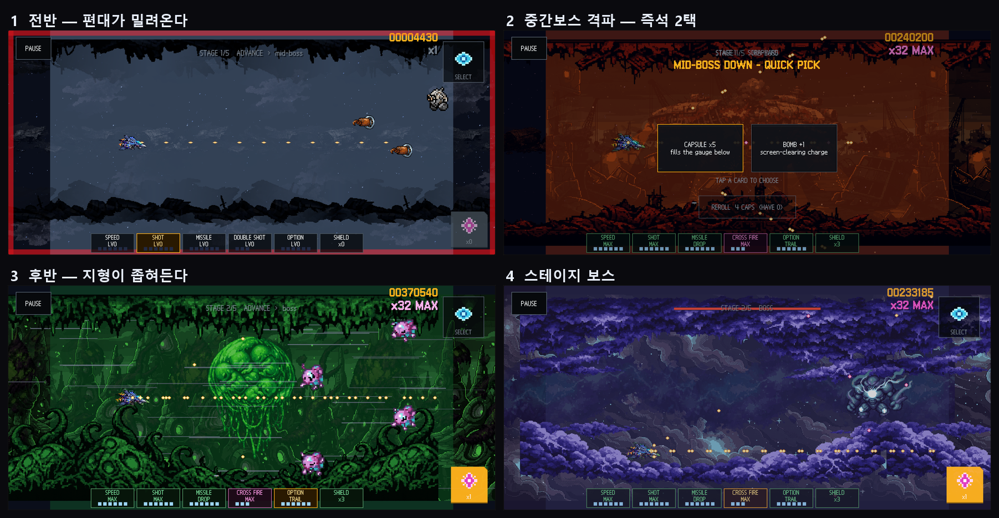
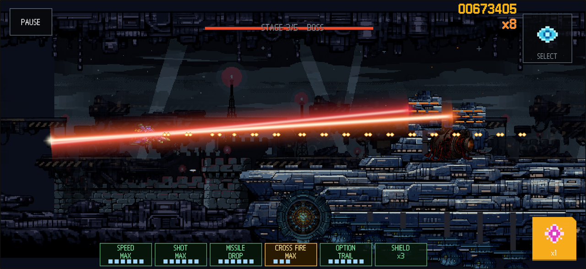
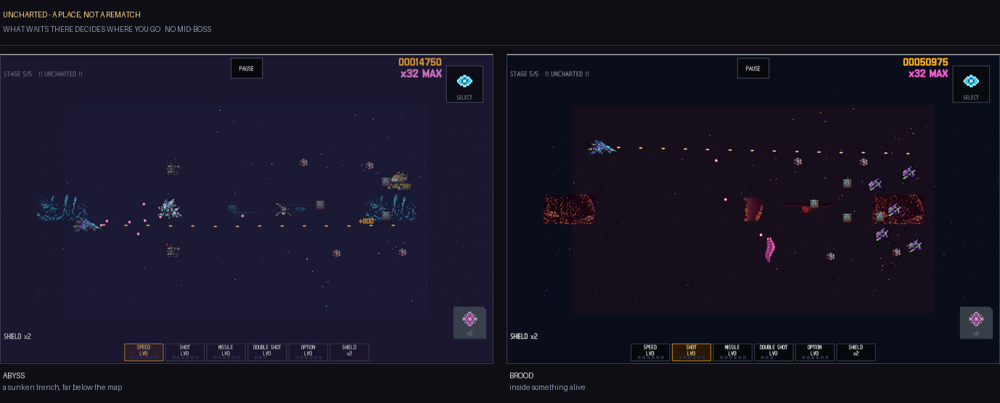
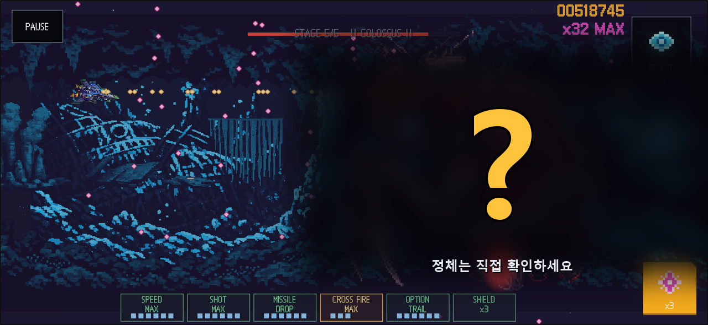

# ROGUELIKE SCROLLING SHOOTER

A SNES-style pixel-art horizontal shmup in the Gradius lineage, built on a roguelike run structure.

**▶ Play now: https://pavy23.github.io/rss-play** — touch on mobile browsers, keyboard or gamepad on desktop.

*[한국어 README](README.ko.md)*

## How a run flows

One run cuts through five biomes: **scrapyard → bio hive → fortress → nebula storm → enemy core**. Each stage runs **opening → mid-boss → late section → stage boss**, and every boss kill hands you a **route card**: which biome comes next, and under what terms — a risk contract like *+40% enemy density in exchange for +50% capsules*. Die and it is over. Your score becomes credits that unlock new ships.

The same seed always builds the same run. That is what makes the **Daily Run** (one global seed for everyone, every day), **Replay** (watch your last run back), and **Continue** (pick up where you stopped) possible.

Each stage changes its look and its threats section by section — the open swarms of the opening give way to dusk after the mid-boss falls, and the late section narrows around you as a landmark closes in.

**Enemies belong to their stage.** The scrapyard has rusted machines and grabber drones; the hive has spores, tendrils and wasps; the fortress has military drones and turrets; the nebula has fog wraiths. Every theme carries at least five of its own, and there is no generic filler enemy.

Early sections send trash mobs in **formations** — single file, staircase diagonals, V-wedges. Wipe a whole formation and it drops a capsule.

## Controls

| Platform | Controls |
|---|---|
| Touch (recommended) | Drag anywhere — the ship follows your finger · fire is always automatic · **SELECT** = spend gauge · **BOMB** = screen-clearing bomb |
| Keyboard | Arrows/WASD move · Space = launch / spend gauge · **B bomb** · T difficulty · **D mode** (normal/daily) · C continue · V replay |
| Gamepad | Stick move · (A) spend · (B) bomb · RB mode · LB replay · (X) continue |

The **MODE** button on the title screen switches between a normal run and the daily challenge — either way you launch with the single **LAUNCH** button in the middle.

The screen speaks in colour: **your shots are orange, enemy shots are magenta.** However thick the bullet pattern gets, one colour tells you which shots can kill you. Cyan means *you cannot damage this yet* — shoot a cyan-pulsing part and your bullets bounce off as cyan sparks.

## Power-ups — the Gradius gauge

**Capsules** dropped by enemies advance a cursor along the gauge. Spend it (SELECT) on whichever cell you want — **where you spend is your build.** One capsule, one level.

| Cell | Effect |
|---|---|
| SPEED | Movement speed (+1.5 per level) |
| SHOT | Main weapon, up to level 6 — +50% damage per level, faster cadence |
| MISSILE | Adds missiles, stronger each level |
| **SHIP WEAPON** | Your hull's signature weapon — **evolves across three tiers** each time you spend here |
| OPTION | Up to six drones that mirror your main gun and missiles |
| SHIELD | **+1 shield in stock** — a count, not a level. Shields are your only lives; a hit at zero kills you |

Each cell shows **a different kind of information**: SHOT shows power, MISSILE shows which *family* is loaded (STRAIGHT / SPREAD / LANCE / DROP / HOMING), OPTION shows the *formation* (TRAIL / FIXED / ORBIT), SHIELD shows how many are left. Missiles and options get swapped out by reward cards, so what matters is what is equipped, not a number.

A shield that eats a hit grants **1.5 seconds of invulnerability** and the ship blinks through it — otherwise breaking a shield mid-pattern just fed you to the next bullet.

## Three ships — three ways to grow

| Ship | Character | Signature weapon (tier 1→2→3) | Missile | Option formation |
|---|---|---|---|---|
| **Starter** | Balanced (1 shield) | Double → **Tail Guard** (rear shots) → **Cross Fire** (four-way cross) | Drop bomb | Trailing |
| **Interceptor** | Fast and fragile (0 shields) | Triple → **Pulse Fan** (5-way pulse) → **Burner** (inertial shots, high cadence) | Straight | Fixed formation |
| **Bulwark** | Slow tank (2 shields) | Laser → **Lance** (pierces 4 + explodes) → **Prism Beam** (sustained beam) | Homing | Orbiting |

Interceptor unlocks for 25,000 credits, Bulwark for 50,000, in the hangar.

## Bosses — the board grows as you go

- Bosses change movement and bullet patterns each phase, and each stage layers its own signature on the shared vocabulary (heavy shells, shrapnel, mines, lasers): scrap throws, larva spawns, laser grids, lightning strikes, rotating prism beams.
- **Each stage adds one more axis of structure.** The stage-2 boss fights with tentacle parts that sweep the screen; the stage-4 boss summons a **lightning dragon** — a segmented chain where only the head matters.
- **Stage 3's entire boss fight is a single capital ship.** The hull fills the screen horizontally and starts **submerged, showing only its deck**, raining missiles. Break the deck turrets and engines and the hull **rises over two seconds to put its keel at eye level** — the heavier turrets down there fire thick beams on a short cycle. Cut through those and the hull settles to centre, opening the bow core. **The more turrets you destroy, the thinner the core phase opens.** Killing the core is not the end: the hull collapses stern to bow and **a robot bursts out of it for the final phase.** All three of the hull's moves happen by **travelling at scroll speed** — it never teleports.
- **The stage-2 organic boss is fought piece by piece.** A shield over its head deflects bullets and only comes off when both legs are broken. The legs are **severed below the knee**, exposing the cut, and losing both triggers a last stand of missiles and energy shots from its arms.
- **In the final stage's late section, your past self comes back** — your stage-1 inputs from this very run replay as a ghost ship fighting beside you. And the final boss is not finished when it falls: a second form is waiting.
- **The uncharted zone holds two things that fill half the screen.** What they are is not written here — they take two conditions to unlock, and naming them would spend the payoff. One has to be cracked open through its outer plating; the other is most dangerous when its maw opens. Both fight in four stages: ordinary fire → **a piercing beam / a fan of lasers** → drifting up and down with a far denser pattern, plus **a wide swing of its forelimb** (it flashes yellow before it commits) → and finally it **sheds its body, leaving only a small core** that throws the thickest pattern of all.
- **The uncharted zone is not a rerun of any stage** — what you meet decides where it opens. Either a **deep-sea trench** (monochrome cyan, wrecks embedded in rock, hydrothermal chimneys, bioluminescence in the dark) or the **inside of a nest** (arches of flesh, swollen egg sacs, tendons hanging from the ceiling). There is no mid-boss — one section, then the boss.

*The colossus is masked on purpose. It takes two conditions to unlock, and showing it here would spend the payoff of arriving.*

- **The screen tells you what you cannot hurt yet** — parts that have not opened sink into shadow and pulse cyan, and shots at them **bounce off as cyan sparks**. When damage does land, the part **flashes red**. One frame tells you whether you are wasting your fire.
- **Every boss tier has its own track.** Mid-bosses keep the battle theme; stage bosses slow down and take on weight; hidden bosses go slower still, into harmony that never lands anywhere. You hear that you have walked into a different kind of fight before you see it.

## Score rewards risk

- **Graze** an enemy bullet and you gain score and multiplier — **one step per graze**, up to **×32**. Consecutive grazes still only climb one step per 0.5s.
- Three things keep a combo alive: **kills, grazes, and damaging a boss.** Five seconds without any of them cools the multiplier one step — though **shots blocked by an invulnerable part do not count** (the cyan sparks). The clock also stops while you are in a boss room before the boss appears and during its entrance. There is no point punishing time you cannot act in.
- The multiplier **carries between rooms** — what you built walking into the mid-boss does not evaporate.
- Clear the three hidden conditions — **3 elite rooms · 2 no-damage biomes · 1 rare encounter** — meeting **2 of 3** opens the extreme route, the **uncharted zone** (score ×1.25). Kill the colossal multipart boss there for a PerfectClear.

## Global scoreboard

**SUBMIT SCORE** on the game-over screen puts you on the world ranking. There are two boards: the **Daily** (one global seed for everyone) and the **All-time** board for free runs.

| Column | Meaning |
|---|---|
| `#` / `PILOT` / `SCORE` | Rank · name (2–10 chars) · score |
| `STG` | How far you got (`3-2` = stage 3 room 2, `CLR` = cleared, `PFT` = PerfectClear) |
| `SHIP` | Hull (`ST` / `IC` / `BW`) |
| `BOMB` | Bombs used — **0 is highlighted as a no-bomb run** |

Only honest runs submit: cheated runs, hand-typed seeds and replays are all blocked. One best entry per device.

## Self-imposed contracts — playing weak is worth points

Route cards mix in **SPARTAN contracts** that tie your hands for a score multiplier:

| Contract | Restriction | Multiplier |
|---|---|---|
| **SPARTAN PROTOCOL** | Cannot spend the gauge at all (capsules still bank) | ×1.6 |
| **BARE HULL** | Cannot spend on shields | ×1.4 |
| **NO OPTION RUN** | Cannot spend on options | ×1.3 |

Try to spend on a locked cell and a **CONTRACT LOCK** marker appears over the gauge.

## Rewards and their price

Every mid-boss and boss hands you a reward card (rerollable for 5 capsules). Some carry **a price written in red** — +2 damage in exchange for −1 maximum shield, say. Missile family swaps, option formation swaps, and bullet mods like pierce, ricochet and kill-explosions come from here too.

## Credits and continues — place your bet

Death turns your score into credits. Credits buy **ship unlocks** (Interceptor 50,000 / Bulwark 100,000) and **continues** (bank up to 8; each one costs more than the last) in the hangar.

- Spending a continue puts you straight back in the fight, but **your run score resets to 0** — the ranking stays honest.
- **The moment you enter the final boss fight, every continue you still hold is cashed in as shields.** What you hoarded becomes your last bet.
- Daily runs cannot use continues — everyone competes on the same terms.

## Saves and privacy

Progress lives **in your own browser**. Credits, ship unlocks, continue stock, difficulty and accessibility options are stored locally on the device you play on — nothing about them is baked into the build, so a copy you hand to someone else starts them at zero. Clearing site data for the page wipes it.

The only shared thing is the **global scoreboard**, and only when you choose to submit: it sends your pilot name, score and run summary, nothing else.
